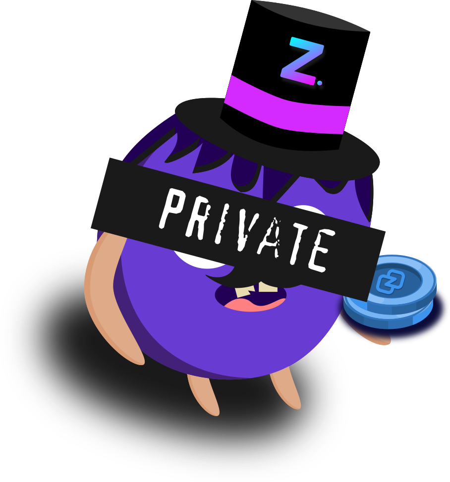

    

# Zano BaZaar - The Decentralized Marketplace

Zano BaZaar is built on Zano and utilizes Zano's Marketplace API, there is little to no centralization on BaZaar and all offers are contained on the Zano Blockchain itself.

NOTE: This document is a work in progress and will be ontinually updated as features are added and battle tested in the wild!

# Cost and usage

To Help combat spam vendor signups, a small, reasonable ZANO cost has been implemented to sign up a basic BaZaar Vendor. There are 3 Vendor tiers: 'basic', 'enhanced' and 'featured' with varying degrees of functionality.

Be aware, this document is a work in progress and will be continuously updated as features are added and has been tested more in the wild!

## Tier: Featured

The Featured Tier will provide full current and future functionality

## Tier: Enhanced

The Enhanced tier will provide elevated functionality from the basic account

## Tier: Basic

The Basic account has will provide the minimal functionality
