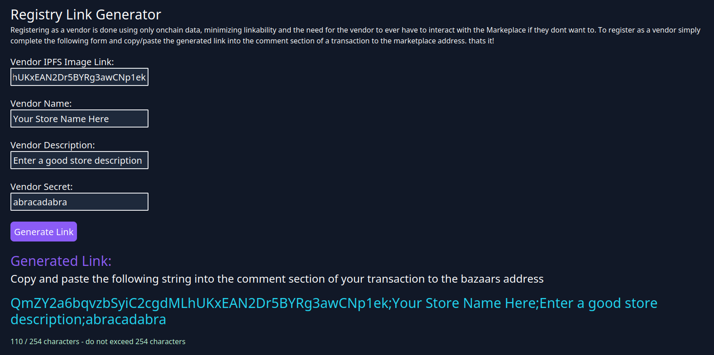
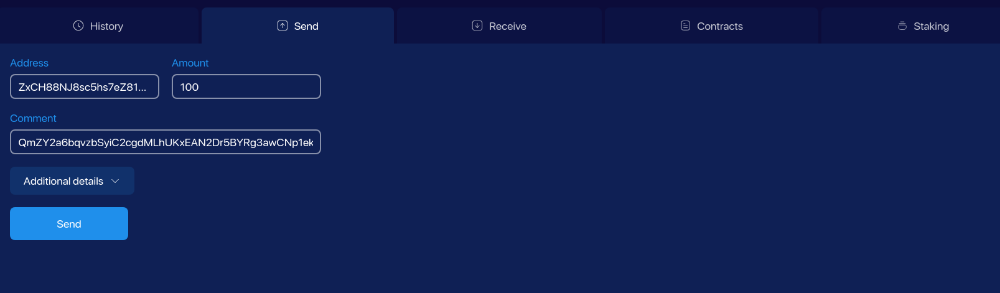
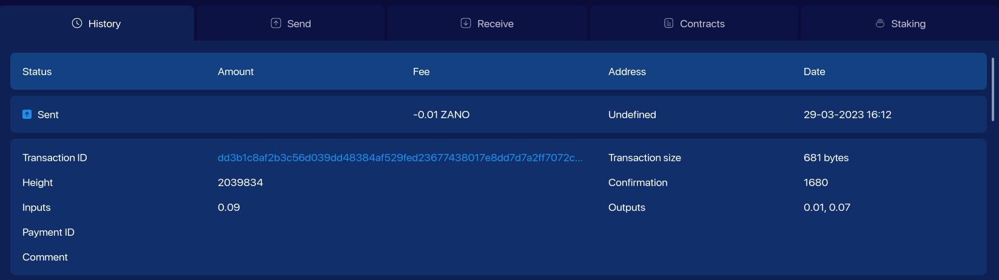

    

# Zano BaZaar - The Decentralized Marketplace

Zano BaZaar is built on Zano and utilizes Zano's Marketplace API, there is little to no centralization on BaZaar and all offers are contained on the Zano Blockchain itself.

**NOTE: This document is a work in progress and will be ontinually updated as features are added and battle tested in the wild!**

# Cost and usage

To Help combat spam vendor signups, a small, reasonable ZANO cost has been implemented to sign up a basic BaZaar Vendor. There are 3 Vendor tiers: 'basic', 'enhanced' and 'featured' with varying degrees of functionality.

Be aware, this document is a work in progress and will be continuously updated as features are added and has been tested more in the wild!

## Tier: "Featured - 100 $ZANO

The Featured Tier will provide full current and future functionality, some features include:

- Featured on the front page above the fold

- Custom URL

- Rating system

- Edit vendor Title and Description

- Display vendors twitter, discord, telegram and github links and email contact

## Tier: "Enhanced - 50 $ZANO

The Enhanced tier will provide elevated functionality from the basic account, some features include:

- Edit vendor Title and Description

- Display vendors twitter, discord, telegram and github links and email contact

## Tier: "Basic"" - 20 $ZANO

The Basic account is quick and dirty, and has minimal functionality

- Display email contact on vendor page

**NOTE: Tier costs and feature are subject to change as features are added**

## Usage - vendor sign up

Signing up as a vendor is quick and easy, to get started, follow these steps:

## Step one:

Navigate to the [vendor registration page](https://zanobazaar.com/register/) and generate your link:

    

Once your link is generated, copy it and head over to your [Zano Wallet](https://zano.org/downloads) to set up your vendor account.

## Step 2:

Fire up your [Zano Wallet](https://zano.org/downloads) and copy/paste your generated link into the comments section:

    

The amount you send dictates which account Tier is set up, this process is automated and cant be undone so make sure you send the correct amount. See the above price Costs and account Tiers section.

### Address:

Now send your transaction to the BaZaars address:

**ZxCH88NJ8sc5hs7eZ813BafmEUY7P1p8V4rEa9KndjWAbMNburuqnwXHruYRfwmqY6LF8fbhK8u7vXAusQYWSpiV1o8KS7X5h**

## Congratulations, your BaZaar is set up!

Once the transaction is confirmed on the blockchain, your BaZaar will be visibile and youll be able to log in.

**NOTE: if you didnt set up a featured BaZaar, you'll have to keep an eye on the [Blockchain Explorer](https://explorer.zano.org) to check whether the Blockchain has confirmed your transaction, otherwise you'll see the BaZaar appear on the front page 'Featured Vendors' section.**

# Logging in

In order to login you will need the hash of the transaction you sent when setting up your BaZaar, and your secret that you generated and sent within the comments, these act as a username and password if you will.

## Getting the Transaction hash

Simply fire up your wallet, and click on the transaction to the BaZaar and copy (click) the hash. Your hash is secured by the blockchain, completely private and visible to nobody (besides the sender and receiver)

    

# Explore

Nice, youve set up your BaZaar, now go and explore your account and get selling stuffs!
